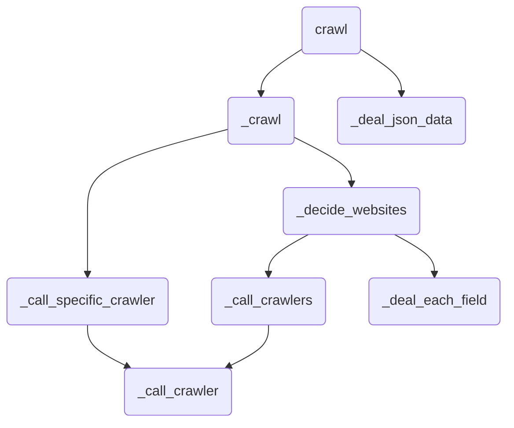

# function call graph

```mermaid
graph TD;
    A(crawl) --> B(_crawl);
    A --> D(_deal_json_data);
    B --> E(_call_specific_crawler);
    B --> F(_decide_websites);
    F --> G(_call_crawlers);
    F --> H(_deal_each_field);
    G --> K(_call_crawler);
    E --> K;
```
